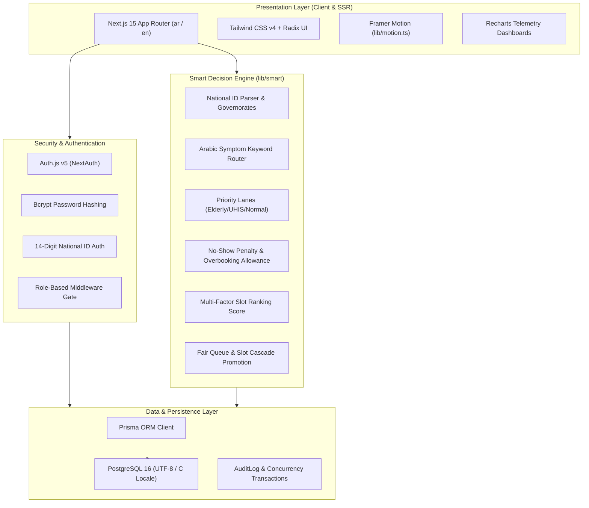

# SmartGov Hospital (مستشفى سمارت جوف)

> **Bilingual (Arabic-First, RTL) Outpatient Clinic Booking & Queue Management Platform for Egyptian Public Hospitals (MoHP / UHIS).**

[](https://nextjs.org/)
[](https://www.typescriptlang.org/)
[](https://www.postgresql.org/)
[](https://www.prisma.io/)
[](https://tailwindcss.com/)
[](https://vitest.dev/)

---

## 1. System Overview

The Egyptian Ministry of Health and Population (MoHP) operates over 520 general, specialized, and teaching hospitals nationwide. Historically, outpatient appointment booking relied on physical morning queues, fragmented phone lines, or regional hotlines, leading to overcrowding, long patient wait times, high no-show rates (~20%), and zero real-time capacity telemetry for health ministry leadership.

**SmartGov Hospital** is a graduation-grade web platform engineered specifically for Egypt's healthcare system and the expanding Universal Health Insurance System (**UHIS / التأمين الصحي الشامل**). It replaces manual walk-in chaos with:
- **Bilingual Arabic-First UI** with native RTL layout and instant English LTR toggle.
- **Explainable Rule-Based Smart Algorithms** (0 external black-box ML/AI services) governing 14-digit National ID parsing, symptom-based triage routing, priority queue lanes, dynamic overbooking caps, slot ranking, and automated waitlist promotion.
- **Multi-Actor Operational Workflows** connecting Citizens, Reception Desk Clerks, Clinic Doctors, Hospital Directors, and Ministry Command Leaders.

---

## 2. Quickstart Setup (≤ 8 Commands)

Run the following commands in order to setup and launch the application:

```bash
# 1. Clone repository
git clone https://github.com/mohamed/smartgov-hospital.git && cd smartgov-hospital

# 2. Install dependencies
pnpm install

# 3. Configure environment variables
copy .env.example .env

# 4. Start local PostgreSQL database (Docker Compose or Embedded UTF-8 Daemon)
docker compose up -d || pnpm db:start

# 5. Run database migrations
pnpm prisma migrate deploy

# 6. Seed realistic Egyptian MoHP data (Governorates, Hospitals, Doctors, Slots, Appointments)
pnpm prisma db seed

# 7. Run automated test suites (Vitest unit tests & concurrency suite)
pnpm test:coverage

# 8. Start the development server
pnpm dev
```

The application will be live at `http://localhost:3000` (defaults to Arabic RTL: `http://localhost:3000/ar`).

---

## 3. Architecture & Tech Stack



### Core Technologies
- **Framework:** Next.js 15 (App Router, Server Actions, API Route Handlers).
- **Language:** TypeScript 5 (Strict mode enabled, 0 `any` compromise).
- **Internationalization:** `next-intl` (Arabic `ar` default RTL, English `en` LTR, locale subpath routing).
- **Styling:** Tailwind CSS v4 tokenized variables in `app/globals.css` (0 raw hex colors, 44px min touch targets).
- **Database:** PostgreSQL 16 via Prisma ORM with versioned migrations.
- **Testing:** Vitest (unit & branch coverage), Concurrency locking suite, Playwright (end-to-end browser tests).

---

## 4. Role & Permission Matrix

| Resource / Action | PATIENT (مواطن) | RECEPTION (استقبال) | DOCTOR (طبيب) | HOSPITAL_ADMIN (مدير مستشفى) | MINISTRY_ADMIN (قيادة الوزارة) |
| :--- | :---: | :---: | :---: | :---: | :---: |
| **Symptom Router & Booking** | ✅ Full | ❌ | ❌ | ❌ | ❌ |
| **View Ticket & Download ICS** | ✅ Own | ✅ All Today | ❌ | ❌ | ❌ |
| **Cancel / Reschedule Appointment** | ✅ Own | ✅ Clinic | ❌ | ❌ | ❌ |
| **Reception Kanban Board** | ❌ | ✅ Read / Write | ❌ | ❌ | ❌ |
| **Walk-in Booking & Check-in** | ❌ | ✅ Desk | ❌ | ❌ | ❌ |
| **Doctor Queue Workspace** | ❌ | ❌ | ✅ Active Clinic | ❌ | ❌ |
| **Call Next & Diagnosis Notes** | ❌ | ❌ | ✅ Consultation | ❌ | ❌ |
| **14-Day Slot Generation** | ❌ | ❌ | ❌ | ✅ Hospital Scope | ✅ National |
| **Blackout Day Scheduling** | ❌ | ❌ | ❌ | ✅ Hospital Scope | ✅ National |
| **National Telemetry & Heatmap**| ❌ | ❌ | ❌ | ❌ | ✅ Full Access |
| **Onboard New Hospital** | ❌ | ❌ | ❌ | ❌ | ✅ Full Access |
| **CSV Bulk Data Export** | ❌ | ❌ | ❌ | ✅ Own Hospital | ✅ Full National |

---

## 5. Seed Demo Credentials

All seed demo accounts share the standard password: **`GovEgypt@2026`**. Quick login cards are available directly on the login page (`/ar/login`).

| Role | National ID (اسم المستخدم) | Representative Name | Governorate | Scope / Assignment |
| :--- | :--- | :--- | :--- | :--- |
| **PATIENT** | `29501010101234` | أحمد محمود إبراهيم | القاهرة | المواطن (حجز، تذاكر، سجل الكشوفات) |
| **RECEPTION** | `28805050105678` | فاطمة حسن رضوان | القاهرة | مكتب استقبال قصر العيني (Check-in / Walk-in) |
| **DOCTOR** | `28003030109012` | د. حازم عبد الله الجزار | القاهرة | استشاري باطنة - قصر العيني (Queue / Note) |
| **HOSPITAL_ADMIN** | `27511110103456` | د. مروان فتحي البهنساوي | القاهرة | مدير مستشفى قصر العيني (توليد المواعيد) |
| **MINISTRY_ADMIN** | `27008080107890` | د. طارق شوقي عبد السلام | جمهورية مصر | مساعد وزير الصحة للطب العلاجي (لوحة القيادة) |

---

## 6. Smart Engine Rules (`lib/smart/`)

Every algorithmic decision in SmartGov Hospital is pure, deterministic, and explainable:

1. **National ID Decoder (`national-id.ts`)**:
   - Parses century digit (`2` = 1900-1999, `3` = 2000-2099), birth date `YYMMDD`, governorate code digits `01-88`, sequence gender digit (odd = male, even = female).
   - Validates Egyptian birth dates against leap years and current calendar boundaries.
2. **Symptom-to-Specialty Router (`specialty-suggest.ts`)**:
   - Tokenizes Arabic and English symptom complaints using regex-based medical lexicon.
   - Computes keyword hit frequency and returns ordered specialty matches with confidence score and match highlights.
3. **Priority Queue Lanes (`priority-lane.ts`)**:
   - Categorizes patients into 3 distinct queue lanes:
     - `PRIORITY_ELDERLY`: Age ≥ 65 years.
     - `PRIORITY_SPECIAL_NEEDS`: Disability or UHIS comprehensive coverage card holders.
     - `NORMAL`: Standard outpatient lane.
4. **No-Show Penalty & Dynamic Overbooking (`no-show-risk.ts`)**:
   - Analyzes historical attendance records. If past no-show rate exceeds 30%, flags high-risk status.
   - Calculates clinic overbooking allowance ($+1$ or $+2$ slots per clinic window) only when historical clinic no-show rate allows absorption without creating unmanageable room congestion.
5. **Multi-Factor Slot Ranking (`slot-ranking.ts`)**:
   - Ranks available slots using a transparent formula:
     $$\text{Score} = (\text{Proximity Score} \times 0.4) + (\text{Earliest Availability} \times 0.35) + (\text{Clinic Utilization Factor} \times 0.25)$$
6. **Waitlist Cascade Engine (`waitlist.ts`)**:
   - When an appointment is canceled, automatically queries the oldest waiting patient (`WAITING` status) and sends immediate notification / 30-minute confirmation window.

---

## 7. API Endpoints Reference

| Method | Endpoint | Description | Access |
| :--- | :--- | :--- | :--- |
| `GET` | `/api/governorates` | List all 27 Egyptian governorates with code and name | Public |
| `GET` | `/api/specialties` | List medical specialties and clinic descriptions | Public |
| `POST` | `/api/specialties/suggest` | Suggest specialty based on free-text symptom input | Public |
| `GET` | `/api/hospitals` | Search hospitals by governorate or specialty | Public |
| `GET` | `/api/slots/search` | Search ranked available slots for specialty/hospital | Public |
| `POST` | `/api/appointments` | Atomically book slot with concurrency protection | Citizen / Patient |
| `GET` | `/api/appointments/[id]` | Fetch appointment details and ticket data | Patient / Reception |
| `POST` | `/api/waitlist` | Join waitlist for fully booked clinic | Patient |
| `GET` | `/api/reception/board` | Live Kanban queue board (Booked/Checked-in/In-Progress) | Reception |
| `POST` | `/api/reception/checkin` | Check-in patient by ticket number or National ID | Reception |
| `POST` | `/api/reception/walk-in` | Issue walk-in ticket within overbooking allowance | Reception |
| `GET` | `/api/doctor/queue` | Today's patient queue for logged-in doctor | Doctor |
| `POST` | `/api/doctor/call-next` | Advance doctor queue and start consultation | Doctor |
| `POST` | `/api/doctor/complete` | Complete consultation and record diagnosis note | Doctor |
| `POST` | `/api/doctor/no-show` | Mark absent patient after 15-minute grace period | Doctor |
| `POST` | `/api/admin/generate-slots` | Generate 14-day schedule slots based on doctor templates | Hospital Admin |
| `POST` | `/api/admin/blackouts` | Record hospital or doctor blackout/holiday date | Hospital Admin |
| `POST` | `/api/admin/onboard` | Register and onboard a new public hospital | Ministry Admin |
| `GET` | `/api/ministry/analytics` | Telemetry KPIs, governorate bars, trends, heat matrix | Ministry Admin |
| `GET` | `/api/ministry/export` | Download complete appointments dataset as UTF-8 CSV | Ministry / Admin |

---

## 8. Verification & Quality Assurance

SmartGov Hospital includes automated test suites covering unit logic, concurrency stress, and end-to-end user flows:

```bash
# 1. Run Vitest Unit Tests with Branch Coverage (Threshold >= 90%)
pnpm test:coverage

# 2. Run Database Concurrency Collision Test (20 parallel requests on capacity-2 slot)
pnpm test tests/concurrency/booking-concurrency.test.ts

# 3. Run Playwright End-to-End Browser Tests
pnpm test:e2e
```
