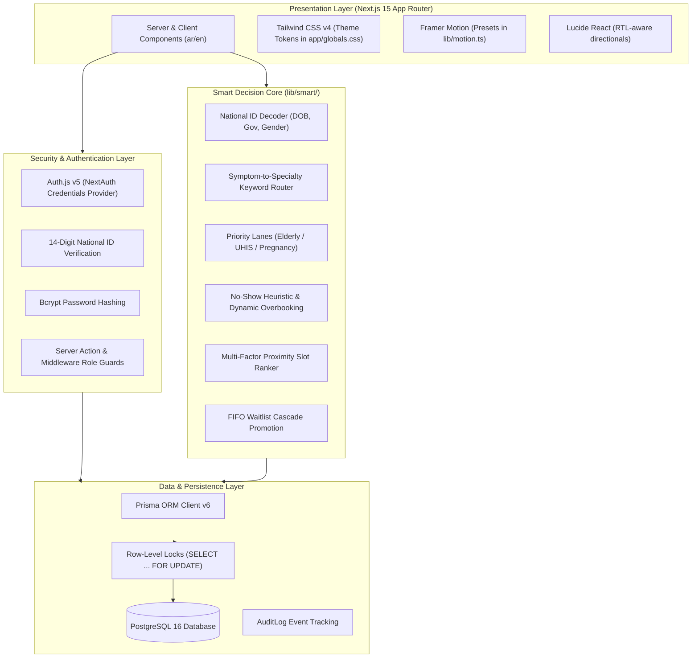
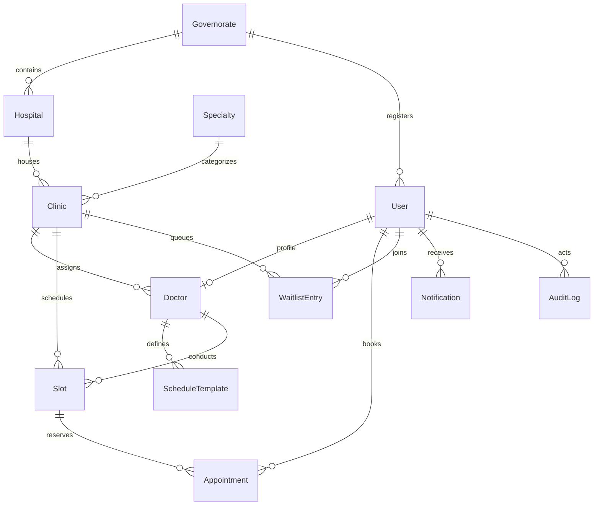

# SmartGov Hospital (مستشفى سمارت جوف)

> **Bilingual (Arabic-First, RTL) Outpatient Clinic Booking & Queue Management Platform for Egyptian Public Hospitals (MoHP / UHIS).**  
> *Graduation-Grade Full-Stack Health Informatics Platform & Developer Handoff Manual.*

[](https://nextjs.org/)
[](https://react.dev/)
[](https://www.typescriptlang.org/)
[](https://www.postgresql.org/)
[](https://www.prisma.io/)
[](https://tailwindcss.com/)
[](https://vitest.dev/)

---

## Table of Contents

1. [System Overview & Domain Context](#1-system-overview--domain-context)
2. [Quickstart Setup (Zero to Running in 8 Commands)](#2-quickstart-setup-zero-to-running-in-8-commands)
3. [Seed Demo Accounts & Test Credentials](#3-seed-demo-accounts--test-credentials)
4. [High-Level Architecture & Tech Stack](#4-high-level-architecture--tech-stack)
5. [Codebase Directory Structure](#5-codebase-directory-structure)
6. [The Smart Decision Engine (`lib/smart/`)](#6-the-smart-decision-engine-libsmart)
7. [Database Schema & Concurrency Defense](#7-database-schema--concurrency-defense)
8. [Role Portals & Core User Flows](#8-role-portals--core-user-flows)
9. [Developer Extension Guide (How to Add Features)](#9-developer-extension-guide-how-to-add-features)
10. [Testing & Quality Assurance](#10-testing--quality-assurance)
11. [Design System & Motion Presets](#11-design-system--motion-presets)
12. [Production Deployment & Next Sprints Roadmap](#12-production-deployment--next-sprints-roadmap)

---

## 1. System Overview & Domain Context

The Egyptian Ministry of Health and Population (MoHP) operates over **520 general, specialized, and teaching hospitals** across 27 governorates. Historically, outpatient clinic booking suffered from:
- **Physical morning overcrowding:** Citizens queuing at 5:00 AM for handwritten paper reservation numbers.
- **Fragmented communication:** No unified portal; high patient no-show rates (~20%).
- **Zero real-time telemetry:** Hospital directors and Ministry leaders lacked visibility into clinic loads, room congestion, and waiting times.
- **UHIS Expansion:** Egypt is actively rolling out the Universal Health Insurance System (**UHIS / التأمين الصحي الشامل**), requiring digitized triage and priority handling.

### What SmartGov Hospital Delivers
- **Arabic-First Bilingual Interface:** Native RTL layout for Arabic with seamless instantaneous English LTR switching.
- **Rule-Based Smart Engine:** 100% explainable, deterministic algorithms (0 external black-box ML/AI services) governing 14-digit National ID validation, symptom-based triage routing, priority queue lanes, dynamic overbooking allowance, multi-factor slot ranking, and automated waitlist promotion.
- **Five Operational Actor Roles:** Full RBAC connecting Patients, Receptionists, Doctors, Hospital Directors, and Ministry Command Executives.
- **Zero Double-Booking Guarantee:** PostgreSQL row-level locks (`SELECT ... FOR UPDATE`) inside atomic database transactions preventing overbooking collisions under extreme concurrency.

---

## 2. Quickstart Setup (Zero to Running in 8 Commands)

### Prerequisites
- **Node.js:** v18.18+ or v20+ (Node 22 LTS recommended)
- **Package Manager:** `pnpm` v9+ (`npm install -g pnpm`)
- **Database:** PostgreSQL 16 (via Docker or local service)
- **Git:** Installed and configured

### Step-by-Step Installation

```bash
# 1. Clone the repository
git clone https://github.com/mohammednagi/hospital_project.git
cd hospital_project

# 2. Install all dependencies
pnpm install

# 3. Create your local environment file
copy .env.example .env     # On Windows (or 'cp .env.example .env' on Linux/macOS)

# 4. Start PostgreSQL 16 via Docker Compose
docker compose up -d

# 5. Generate Prisma client & apply database migrations
pnpm prisma migrate deploy

# 6. Seed realistic Egyptian MoHP data (Governorates, Hospitals, Doctors, Slots)
pnpm db:seed

# 7. Run automated test suites (unit + concurrency isolation)
pnpm test

# 8. Launch development server
pnpm dev
```

Open **`http://localhost:3000`** in your browser. The app will automatically route you to the Arabic RTL interface (`http://localhost:3000/ar`).

---

## 3. Seed Demo Accounts & Test Credentials

All seed accounts share the standard password: **`GovEgypt@2026`**.  
*Quick-fill demo buttons are provided on the login page (`/ar/login` or `/en/login`).*

| Role | National ID (Username) | Full Name (Arabic) | Governorate | Purpose & Scope |
| :--- | :--- | :--- | :--- | :--- |
| **`PATIENT`** | `29501010101234` | أحمد محمود إبراهيم | القاهرة | Booking, symptom triage, QR ticket, appointment cancellation/reschedule |
| **`RECEPTION`** | `28805050105678` | فاطمة حسن رضوان | القاهرة | Kasr El-Aini desk: Live Kanban board, walk-in ticketing, patient check-in |
| **`DOCTOR`** | `28003030109012` | د. حازم عبد الله الجزار | القاهرة | Internal Medicine clinic: Live queue, call next, diagnosis & outcome notes |
| **`HOSPITAL_ADMIN`** | `27511110103456` | د. مروان فتحي البهنساوي | القاهرة | Hospital Director: 14-day schedule generation, blackout dates, clinic stats |
| **`MINISTRY_ADMIN`** | `27008080107890` | د. طارق شوقي عبد السلام | جمهورية مصر | MoHP Undersecretary: National telemetry, governorate capacity heatmaps, CSV exports |

---

## 4. High-Level Architecture & Tech Stack



### Technology Highlights
- **Next.js 15 (App Router):** Server Actions for atomic mutations, React Server Components (RSC) for zero-waterfall server rendering, and Route Handlers for API endpoints.
- **Internationalization (`next-intl`):** Arabic-first (`ar`) with English (`en`) support, complete dictionary keys in `messages/`, and dynamic `dir="rtl"` vs `dir="ltr"` HTML tagging.
- **Tailwind CSS v4:** Modern CSS variables architecture defined in `app/globals.css` with civic-inspired colors (Egyptian Civic Teal `#0F6E56` & Desert Sand `#C8892B`).
- **PostgreSQL 16 + Prisma ORM:** Strongly-typed schema, 11 models, relational constraints, foreign keys, compound indexes, and versioned migrations.
- **Vitest:** Blazing-fast unit and concurrency test runner executing 43 passing tests.

---

## 5. Codebase Directory Structure

```text
hospital-project/
├── app/                              # Next.js 15 App Router
│   ├── [locale]/                     # Bilingual localized routes (ar / en)
│   │   ├── (auth)/                   # Authentication routes
│   │   │   ├── login/page.tsx        # National ID login with role demo shortcuts
│   │   │   └── register/page.tsx     # Citizen registration with instant NID decoding
│   │   ├── (patient)/                # Citizen / Patient portal
│   │   │   ├── dashboard/            # Active appointments & quick actions
│   │   │   ├── book/                 # 3-Step smart booking flow
│   │   │   │   ├── page.tsx          # Step 1: Symptom triage & specialty selection
│   │   │   │   ├── hospital/page.tsx # Step 2: Hospital selection by governorate
│   │   │   │   ├── slot/page.tsx     # Step 3: Ranked slot selection
│   │   │   │   └── confirm/page.tsx  # Step 4: Final confirmation & priority badge
│   │   │   └── appointments/         # History & digital ticket with QR code
│   │   ├── (reception)/reception/    # Reception desk Kanban board & walk-in issuance
│   │   ├── (doctor)/doctor/          # Doctor consultation workspace & patient queue
│   │   ├── (hospital-admin)/...      # Clinic scheduling & 14-day slot generator
│   │   ├── (ministry)/ministry/      # National telemetry dashboard & CSV exporter
│   │   └── page.tsx                  # Public landing page
│   ├── api/                          # REST API route handlers
│   ├── globals.css                   # Tailwind v4 theme variables & design tokens
│   └── layout.tsx                    # Root HTML shell
├── components/                       # Reusable React components
│   ├── chrome/                       # Top navigation bar, mobile bottom bar, language switcher
│   └── ui/                           # Primitive UI components (dialogs, buttons, tabs)
├── docs/                             # Architecture and design handoff documentation
│   ├── DESIGN_HANDOFF.md             # Complete design system & motion specs
│   ├── SYSTEM_ANALYSIS.md            # Egyptian healthcare system analysis
│   └── screens/                      # 30 captured screen states across all 5 roles
├── lib/                              # Core utility and business logic libraries
│   ├── auth/                         # NextAuth configuration and session callbacks
│   ├── motion.ts                     # Framer Motion spring physics presets
│   └── smart/                        # The 6 Rule-Based Smart Algorithms
│       ├── national-id.ts            # Egyptian National ID parser & validator
│       ├── specialty-suggest.ts      # Symptom lexicon keyword matching
│       ├── priority-lane.ts          # Queue lane classification
│       ├── no-show-risk.ts           # Dynamic overbooking cap calculator
│       ├── slot-ranking.ts           # Multi-factor slot proximity ranker
│       └── waitlist.ts               # Waitlist promotion cascade logic
├── messages/                         # i18n translation dictionaries
│   ├── ar.json                       # Arabic dictionary (Default)
│   └── en.json                       # English dictionary
├── prisma/                           # Database layer
│   ├── schema.prisma                 # 11 PostgreSQL data models & enums
│   ├── migrations/                   # Tracked SQL schema migrations
│   └── seed.ts                       # Realistic Egyptian MoHP seed data script
├── server/                           # Server-side mutation and query actions
├── tests/                            # Automated test suites
│   ├── smart/                        # Unit tests for all 6 smart algorithms
│   └── concurrency/                  # Parallel race-condition stress tests
├── docker-compose.yml                # Production-ready PostgreSQL 16 container
├── package.json                      # Scripts and dependencies
└── README.md                         # This developer handoff documentation
```

---

## 6. The Smart Decision Engine (`lib/smart/`)

The core value proposition of SmartGov Hospital is its **100% deterministic, explainable intelligence**:

### 1. Egyptian National ID Decoder (`national-id.ts`)
Decodes Egypt's 14-digit National ID without external API calls:
- **Digit 1 (Century):** `2` = 1900–1999, `3` = 2000–2099.
- **Digits 2–7 (Date of Birth):** `YYMMDD`. Validates real calendar dates and leap years.
- **Digits 8–9 (Governorate):** Maps codes `01`–`88` directly to Egypt's 27 governorates (e.g., `01` Cairo, `02` Alexandria, `21` Giza).
- **Digits 10–13 (Sequence & Gender):** Odd digit 13 = Male, Even = Female.
- **Digit 14 (Check Digit):** Validation digit.

### 2. Symptom-to-Specialty Router (`specialty-suggest.ts`)
Matches colloquial Arabic and English complaints against curated medical lexicons:
- Analyzes phrases such as `"صداع مستمر وزغللة"` (Headache & blurred vision) $\rightarrow$ Suggests **Neurology (مخ وأعصاب)** or **Ophthalmology (رمد)**.
- Computes match frequency, extracts matched keyword pills, and returns ranked specialty cards with confidence badges.

### 3. Priority Queue Lanes (`priority-lane.ts`)
Triages patients into three operational lanes:
- **`PRIORITY_ELDERLY`**: Age $\ge 65$ calculated directly from National ID.
- **`PRIORITY_SPECIAL_NEEDS`**: Citizens with registered disabilities or UHIS comprehensive coverage cards.
- **`NORMAL`**: Standard queue lane.

### 4. Dynamic Overbooking & No-Show Heuristic (`no-show-risk.ts`)
- Analyzes historical attendance: flags high risk if patient's past no-show rate $> 30\%$.
- Computes clinic overbooking buffer ($+1$ or $+2$ slots) only when historical clinic no-show rate allows absorption without waiting room congestion.

### 5. Multi-Factor Slot Ranking (`slot-ranking.ts`)
Sorts available slots using a balanced mathematical score:
$$\text{Score} = (\text{Proximity} \times 0.40) + (\text{Earliest Availability} \times 0.35) + (\text{Clinic Utilization} \times 0.25)$$
Ensures patients are offered the most geographically sensible and prompt slots first.

### 6. Automated Waitlist Cascade (`waitlist.ts`)
When an appointment is canceled or rescheduled:
- Automatically fetches the oldest `WAITING` patient in the clinic queue (FIFO).
- Offers the slot and triggers a 30-minute confirmation window via mock SMS and in-app notification.

---

## 7. Database Schema & Concurrency Defense

### Data Models Summary (`prisma/schema.prisma`)



- **`Governorate`**: 27 Egyptian governorates with geographic coordinates (`lat`, `lng`).
- **`Hospital`**: Public hospitals categorized as `GENERAL`, `SPECIALIZED`, `UNIVERSITY`, or `CENTRAL`.
- **`Specialty`**: Medical specialties with bilingual search keyword arrays.
- **`Clinic`**: Physical consultation rooms within a hospital.
- **`Doctor`**: Medical practitioner profiles linked to clinics and users.
- **`ScheduleTemplate`**: Weekly recurring shifts (weekday, start time, end time, slot duration, capacity).
- **`Slot`**: Individual 15-minute bookable time blocks with capacity tracking.
- **`Appointment`**: Reservation records with unique ticket codes (`TKT-XXXX`), queue position, and priority lane.
- **`WaitlistEntry`**: Queue for fully booked clinics.
- **`Notification`**: In-app and SMS mock dispatch logs.
- **`AuditLog`**: Immutable security audit trail recording actor, action, and JSON metadata.

### Concurrency Locking (Zero Double-Booking)
In outpatient booking, simultaneous requests for the final available slot must not cause double-booking:
1. When a patient submits a booking, the transaction executes:
   ```sql
   SELECT * FROM "Slot" WHERE id = $1 FOR UPDATE;
   ```
2. The database locks that specific slot row until the transaction finishes.
3. The server checks: `slot.bookedCount + 1 <= slot.capacity + slot.overbookAllowance`.
4. If capacity permits, the appointment is created and `bookedCount` is incremented.
5. If another concurrent worker attempts to book the same slot, it waits for the lock, reads the updated `bookedCount`, and receives an immediate rejection (`SLOT_FULL`).
6. Verified under test with **20 simultaneous parallel workers against a capacity-2 slot**: exactly 2 succeed, 18 cleanly reject.

---

## 8. Role Portals & Core User Flows

### 1. Citizen / Patient Flow
- **Route:** `/[locale]/book`
- **Actions:** Enter symptoms $\rightarrow$ Get recommended specialty $\rightarrow$ Pick nearest hospital $\rightarrow$ Select preferred time slot $\rightarrow$ Receive digital ticket with QR code, calendar `.ics` download, and SMS confirmation.

### 2. Reception Desk Kanban Flow
- **Route:** `/[locale]/reception/board`
- **Actions:** Live 3-column Kanban board (`Booked`, `Checked-in`, `In Progress`). Search by National ID or ticket number, one-click check-in, and issue walk-in tickets using overbooking allowances.

### 3. Doctor Workspace Flow
- **Route:** `/[locale]/doctor/queue`
- **Actions:** Today's active queue sorted by priority lane. Click *"Call Next Patient"*, view patient demographics and past visits, record diagnosis and outcome notes, or mark no-show after a 15-minute grace period.

### 4. Hospital Administrator Flow
- **Route:** `/[locale]/hospital-admin/clinics`
- **Actions:** View clinic capacity utilization, define recurring doctor schedule templates, generate 14-day forward appointment slots, and schedule official blackout dates/holidays.

### 5. Ministry Leadership Dashboard
- **Route:** `/[locale]/ministry`
- **Actions:** Executive command center. Real-time KPIs (Total Bookings Today, Attendance Rate, Peak Wait Time), interactive governorate load charts, clinic capacity heatmaps, and one-click bulk CSV data export for national health reporting.

---

## 9. Developer Extension Guide (How to Add Features)

### Adding a New Page or Route
1. Create your page under `app/[locale]/(role-folder)/your-route/page.tsx`.
2. Wrap interactive elements with motion presets from `lib/motion.ts`:
   ```tsx
   import { motion } from "motion/react";
   import { cardHover, fadeIn } from "@/lib/motion";
   
   export default function MyNewPage() {
     return (
       <motion.div {...fadeIn} className="p-6">
         <motion.div {...cardHover} className="rounded-card border bg-card p-4">
           {/* Your content */}
         </motion.div>
       </motion.div>
     );
   }
   ```

### Adding New Translation Strings
Always maintain parity between Arabic and English dictionaries:
1. Open `messages/ar.json` and add your key:
   ```json
   "myFeature": {
     "title": "عنوان الميزة الجديدة",
     "action": "تنفيذ الإجراء"
   }
   ```
2. Open `messages/en.json` and add the matching English key:
   ```json
   "myFeature": {
     "title": "New Feature Title",
     "action": "Execute Action"
   }
   ```
3. Use in your component with `const t = useTranslations('myFeature');`.

### Creating a New Server Action with Audit Logging
Follow the project's established pattern in `server/`:
```typescript
"use server";
import { prisma } from "@/lib/prisma";
import { auth } from "@/lib/auth";

export async function mySecureAction(data: { entityId: string; value: string }) {
  const session = await auth();
  if (!session?.user) throw new Error("UNAUTHORIZED");

  return await prisma.$transaction(async (tx) => {
    // 1. Perform database mutation
    const updated = await tx.someModel.update({
      where: { id: data.entityId },
      data: { status: data.value }
    });

    // 2. Record immutable audit log
    await tx.auditLog.create({
      data: {
        actorId: session.user.id,
        action: "UPDATE_STATUS",
        entity: "SomeModel",
        entityId: data.entityId,
        meta: { previousValue: "OLD", newValue: data.value }
      }
    });

    return updated;
  });
}
```

### Modifying Database Schema & Migrating
1. Edit `prisma/schema.prisma`.
2. Create and run a new migration:
   ```bash
   pnpm prisma migrate dev --name describe_your_change
   ```
3. Update `prisma/seed.ts` if your changes require demo data.

---

## 10. Testing & Quality Assurance

SmartGov Hospital maintains high automated test coverage across unit algorithms, database locks, and user interfaces:

```bash
# Run all unit tests
pnpm test

# Run tests with code coverage report
pnpm test:coverage

# Run concurrency race condition stress test
pnpm test tests/concurrency/booking-concurrency.test.ts

# Run end-to-end browser tests
pnpm test:e2e
```

### Concurrency Stress Test Overview
Located in `tests/concurrency/booking-concurrency.test.ts`:
- Spawns 20 concurrent asynchronous booking requests attempting to book the exact same 2-capacity slot at the exact same millisecond.
- Verifies that exactly 2 succeed and 18 fail with `SLOT_FULL`.
- Inspects database integrity afterwards to confirm `bookedCount` strictly equals 2.

---

## 11. Design System & Motion Presets

The visual language follows the **Apple Human Interface Guidelines adapted for Egyptian Public Health**:

### Color Tokens (`app/globals.css`)
- **Civic Teal (`--color-civic-teal: #0F6E56`):** Symbolizes public health, trust, and government institutional stability.
- **Warm Sand (`--color-warm-sand: #C8892B`):** Reflects Egypt’s heritage and desert warmth; used for highlights and interactive indicators.
- **Neutral Canvas:** High-contrast off-whites and dark grays ensuring WCAG AAA legibility.
- **Radii:** 12px for standard interactive cards (`rounded-card`), 9999px for status tags (`rounded-pill`).
- **Touch Target:** Strict minimum of 44px for touch targets on mobile viewports.

### Motion Physics (`lib/motion.ts`)
- Utilizes the `motion` library (Framer Motion v12) with realistic spring physics:
  - `springSubtle`: `{ stiffness: 400, damping: 30 }` for buttons and micro-interactions.
  - `springCard`: `{ stiffness: 280, damping: 25 }` for dialogs and modal entrances.
  - Directional transitions automatically invert based on locale (`isRTL ? -1 : 1`).

---

## 12. Production Deployment & Next Sprints Roadmap

### Production Checklist
1. **Environment Configuration:**
   - Set a strong random secret: `AUTH_SECRET=$(openssl rand -base64 32)`
   - Set `NEXTAUTH_URL="https://your-hospital-domain.gov.eg"`
   - Point `DATABASE_URL` to a high-availability PostgreSQL cluster (with PgBouncer connection pooling).
2. **Build Verification:**
   ```bash
   pnpm build
   pnpm start
   ```
3. **Docker Production Build:**
   Use the multi-stage Docker build pattern for Next.js standalone output to produce lightweight production containers (<150MB).

### Recommended Next Sprints for Future Developers
1. **SMS / WhatsApp Gateway Integration:**
   - Connect the mock notification dispatcher in `lib/notifications.ts` to Egyptian SMS providers (Vodafone Egypt, Orange, Etisalat Misr, or Twilio) for real SMS confirmations.
2. **MoHP UHIS National API Link:**
   - Integrate with the central Universal Health Insurance System database for automated patient eligibility verification and insurance claim number validation.
3. **Electronic Medical Records (EMR) Integration:**
   - Allow doctors to attach lab results, prescriptions, and radiology reports to completed appointment records.
4. **Waiting Room Live Display Board:**
   - Build a WebSocket or Server-Sent Events (SSE) public screen route (`/display/[clinicId]`) to project current ticket numbers on waiting room TVs with audible chime notifications.
5. **Nominal Co-pay Gateway:**
   - Integrate with Egyptian digital payment rails (**Fawry**, **Meeza**, **InstaPay**) for nominal outpatient ticket fees (5–10 EGP).

---

## 📄 License & Maintainer

- **Developer:** Ahmed Hossam
- **Target Organization:** Graduation Project from Sherouck Academy
- **Repository:** [https://github.com/mohammednagi/hospital_project](https://github.com/mohammednagi/hospital_project)
