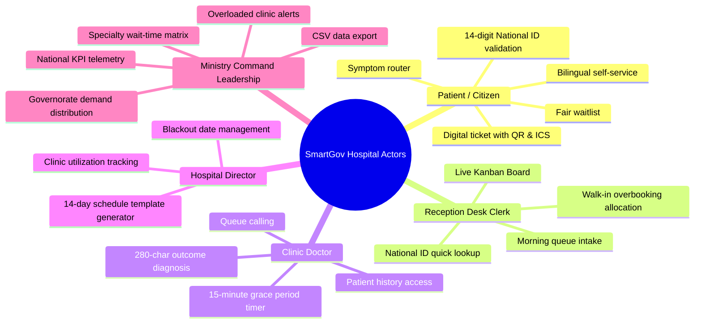
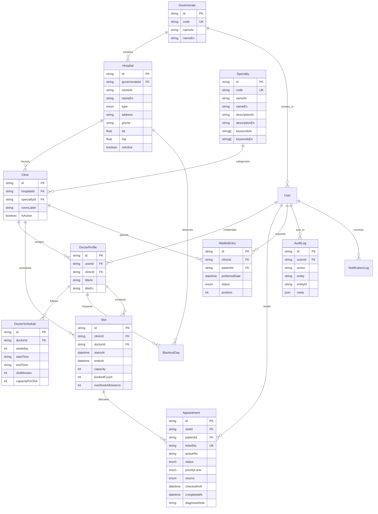
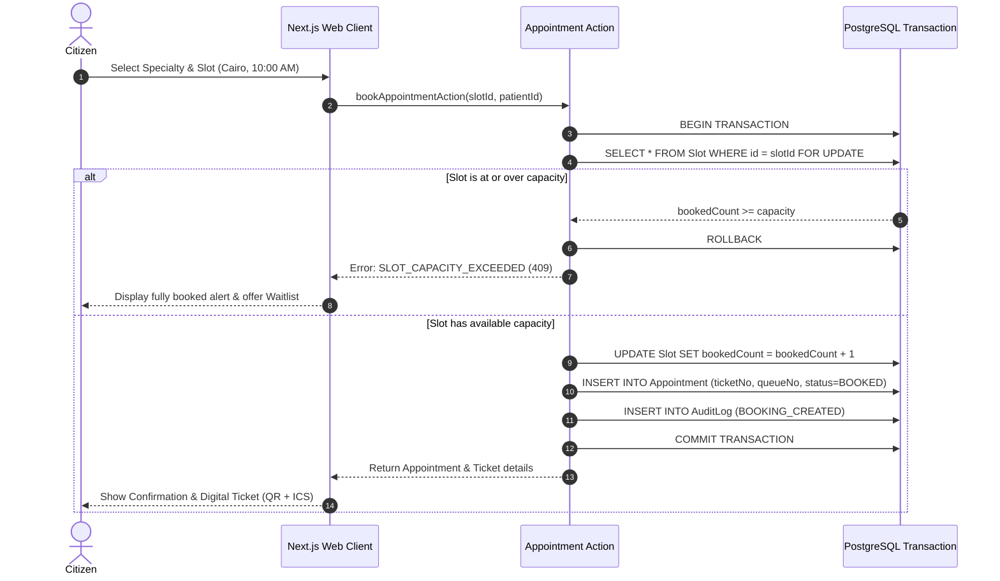
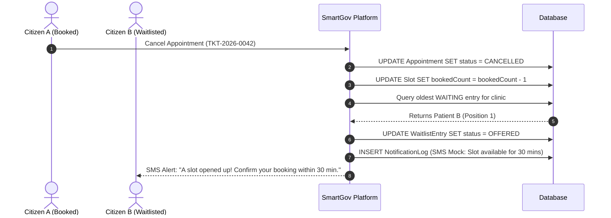
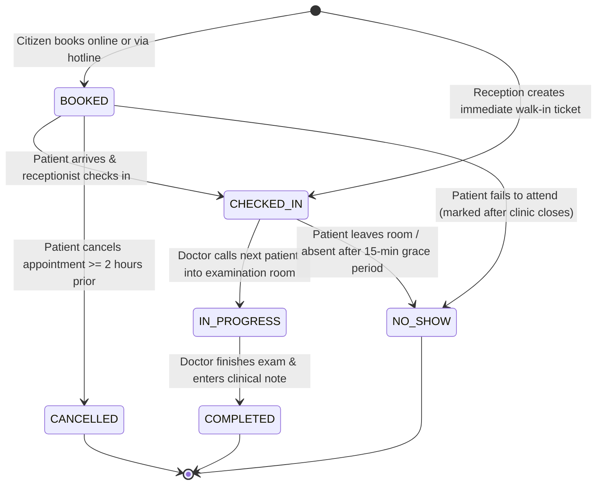

# SmartGov Hospital — System Analysis & Architecture Specification

> **A Comprehensive Engineering Analysis of Egypt's National Outpatient Appointment & Capacity Telemetry Platform.**

---

## 1. Context & Problem Statement

### 1.1 The Egyptian Healthcare Landscape
The Ministry of Health and Population (MoHP) of the Arab Republic of Egypt oversees approximately 520 government-run general, specialized, and university-affiliated hospitals. These institutions serve over 105 million citizens as the primary safety net for medical care. In parallel, Egypt is progressively implementing the Universal Health Insurance System (**UHIS / منظومة التأمين الصحي الشامل**), currently rolling out across designated Phase 1 governorates (Port Said, Luxor, Ismailia, South Sinai, Aswan, and Suez) and expanding into Greater Cairo and the Delta.

### 1.2 The Traditional Operational Bottlenecks
Prior to modern queue digitization, outpatient clinic visits suffered from severe structural inefficiencies:
1. **The Morning Congestion Spiral:** Citizens typically queue outside hospital gates from 6:00 AM to secure a physical paper token for a clinic opening at 9:00 AM.
2. **Fragmented Booking Portals:** Where regional digital initiatives existed, they lacked central coordination, requiring citizens to memorize different local phone numbers or hospital-specific portals.
3. **High No-Show Rates:** Outpatient clinics frequently observed 15% to 25% patient absenteeism without prior notice, leaving clinical hours underutilized while walk-in patients were turned away.
4. **Blind Hospital Administration:** Hospital directors and central health ministry planners lacked live telemetry on clinic utilization, doctor attendance, wait times, or regional specialty deficits.

---

## 2. Stakeholders & User Personas



### Persona Archetypes
1. **Citizen (مواطن):** *Hajj Mahmoud, 68, Giza.* Retired civil servant needing a Cardiology consultation. He uses his phone, enters his 14-digit National ID (system automatically identifies him as elderly for priority queue placement), picks an appointment near his residence, and receives an SMS ticket.
2. **Reception Clerk (موظف استقبال):** *Fatima, 28, Cairo.* Greets citizens at Qasr El-Ayni Hospital reception desk. Scans incoming QR tickets or inputs National IDs to immediately confirm patient arrival and route them to room 204.
3. **Outpatient Physician (طبيب العيادة):** *Dr. Hazem, 38, Internal Medicine Consultant.* Operates the outpatient clinic station. Sees the priority-ordered patient queue, clicks "Call Next", reviews symptoms, and completes consultation with a concise clinical note.
4. **Hospital Director (مدير المستشفى):** *Dr. Marwan, 52.* Manages hospital operational capacity. Generates clinic slots 14 days ahead, defines national holiday blackouts, and monitors clinic room loads.
5. **Ministry Decision Maker (قيادة الوزارة):** *Dr. Tarek, Undersecretary for Curative Care.* Monitors nationwide hospital capacity across 27 governorates, detects clinics with >90% occupancy, and onboards new hospital facilities.

---

## 3. Requirements Specification

### 3.1 Functional Requirements (FR)
- **FR-01: National ID Decoding:** Validate 14-digit Egyptian National IDs, extracting century, birthdate, governorate of origin, and biological gender without external identity APIs.
- **FR-02: Rule-Based Symptom Router:** Tokenize free-text Arabic and English symptom complaints and rank top-3 matched clinical specialties.
- **FR-03: Proximity & Availability Slot Search:** Rank available slots using spatial distance from user's governorate and earliest available consultation time.
- **FR-04: Atomic Booking & Concurrency Control:** Prevent double-booking on slots with capacity $N$ using database transactions with row-level locking.
- **FR-05: Digital Ticket & Calendar Generation:** Issue tickets containing unique ticket codes (`TKT-YYYYMMDD-XXXX`), queue position, dynamic QR codes, and downloadable `.ics` calendar files.
- **FR-06: Automated Waitlist Cascade:** Enable citizens to queue for fully booked clinics and automatically cascade open slots upon appointment cancellations.
- **FR-07: Live Reception Kanban Board:** Display columns for `BOOKED`, `CHECKED_IN`, `IN_PROGRESS`, and `COMPLETED`/`NO_SHOW` with quick check-in actions.
- **FR-08: Smart Walk-In Booking:** Allow receptionists to register walk-in patients up to the clinic's dynamically calculated overbooking allowance.
- **FR-09: Doctor Queue & Grace Period Timer:** Provide doctors with priority-ordered patient queues and enforce a 15-minute grace period before enabling the "No-Show" action.
- **FR-10: 280-Character Clinical Notes:** Record structured consultation diagnosis and disposition notes upon visit completion.
- **FR-11: Idempotent 14-Day Slot Generation:** Generate slots for all hospital clinics based on weekly doctor templates, avoiding duplicate records.
- **FR-12: National Central Command Telemetry:** Provide real-time KPIs (appointments today, average wait days, no-show rate, utilization), bar charts, trend curves, and overloaded clinic lists.
- **FR-13: UTF-8 BOM CSV Export:** Export complete historical appointment records with Arabic headers compatible with Microsoft Excel.

### 3.2 Non-Functional Requirements (NFR)
- **NFR-01: Performance:** Core API responses (slot search, booking, queue status) must resolve in $< 200\text{ ms}$ under standard loads.
- **NFR-02: Concurrency Isolation:** Under concurrent requests exceeding slot capacity, zero overbookings are permitted; excess requests must receive standard HTTP 409 responses.
- **NFR-03: Internationalization (i18n):** Native Arabic-first layout (`dir="rtl"`) with seamless toggle to English (`dir="ltr"`).
- **NFR-04: Responsive Accessibility:** Full layout fidelity at mobile viewports ($375\text{ px}$) and desktop viewports ($1440\text{ px}$) with minimum $44\text{ px}$ touch targets.
- **NFR-05: Zero External Dependencies:** No paid external ML, SMS, or payment gateways; all rules and simulators are self-contained.

---

## 4. Entity-Relationship Diagram (ERD)



---

## 5. System Interaction & Sequence Diagrams

### 5.1 Patient Booking Sequence (with Concurrency Row-Lock)


### 5.2 Reception Check-in & Doctor Consultation Sequence
```mermaid
sequenceDiagram
    autonumber
    actor Patient as Citizen
    actor Reception as Reception Clerk
    actor Doctor as Outpatient Doctor
    participant System as SmartGov Platform

    Patient->>Reception: Presents Ticket / National ID
    Reception->>System: Check-in patient (POST /api/reception/checkin)
    System->>System: Set status = CHECKED_IN, checkedInAt = NOW()
    System-->>Reception: Move card to "Checked-in" column
    Doctor->>System: Opens Doctor Queue Workspace
    System-->>Doctor: Display priority-sorted queue (Elderly first)
    Doctor->>System: Click "Call Next Patient"
    System->>System: Set status = IN_PROGRESS
    Doctor->>Patient: Conducts medical consultation
    Doctor->>System: Enters diagnosis note & clicks "Complete"
    System->>System: Set status = COMPLETED, completedAt = NOW()
    System-->>Doctor: Queue updated; ready for next patient
```

### 5.3 Appointment Cancellation & Waitlist Cascade Sequence


---

## 6. Appointment Lifecycle State Machine



---

## 7. Detailed Role User Flows

### 7.1 Citizen / Patient Journey
1. **Landing & Identity:** Accesses portal at `/ar`, clicks "Book Outpatient Appointment". Signs in with 14-digit National ID and password or registers.
2. **Symptom Matching (Step 1):** Types symptoms (e.g. *"أعاني من ضيق تنفس وألم بالصدر"*). The smart router suggests **Cardiology (أمراض القلب والأوعية الدموية)** with 95% confidence score.
3. **Hospital Selection (Step 2):** System calculates distances from citizen's residence and displays nearest accredited hospitals with wait-time indicators.
4. **Slot Choice (Step 3):** Ranks morning and afternoon slots by doctor seniority, queue length, and time to availability.
5. **Confirmation & Ticket (Step 4):** Finalizes booking atomically. Instant issuance of visual ticket featuring printable summary, QR code for desk scanning, and Apple/Google `.ics` calendar sync.

### 7.2 Receptionist Desk Journey
1. **Morning Inspection:** Logs into `/ar/reception/board` to view today's booked patients across all hospital clinics.
2. **Check-In Intake:** As patients arrive, searches by National ID or scans QR code, transitioning status to `CHECKED_IN`.
3. **Walk-In Handling:** For citizens without prior reservations, clicks "Immediate Walk-In", inputs National ID, checks remaining overbooking quota, and issues on-the-spot queue ticket.

### 7.3 Doctor Consultation Journey
1. **Clinic Intake:** Enters examination room and visits `/ar/doctor/queue`.
2. **Queue Management:** Views waiting room patients sorted automatically with elderly and UHIS cardholders prioritized.
3. **Calling & Examination:** Clicks "Call Next". System starts 15-minute grace period timer. If patient is present, conducts medical examination.
4. **Discharge Note:** Writes up to 280 characters of clinical summary (e.g., *"فحص سليم، تم قياس الضغط ووصف دواء كابوتين ومتابعة بعد أسبوعين"*), clicks "Complete Consultation", and auto-advances to the next patient.

### 7.4 Hospital Administrator Journey
1. **Clinic Overview:** Navigates to `/ar/hospital-admin/clinics` to review weekly clinic capacities and current booking load.
2. **Automated Slot Engine:** Clicks "Generate Next 14 Days Slots" to run idempotent schedule batch generation based on active doctor timetable templates.
3. **Blackout Scheduling:** Adds hospital-wide or doctor-specific blackout dates for official national holidays or emergency maintenance.

### 7.5 Ministry Central Command Journey
1. **National Telemetry:** Opens `/ar/ministry/dashboard` displaying nationwide statistics: daily appointment volume, national average wait days, no-show percentages, and aggregate clinic utilization.
2. **Governorate Comparison:** Explores bar charts comparing booking volumes across Cairo, Alexandria, Giza, Assiut, and other governorates.
3. **Overloaded Clinic Detection:** Identifies clinics operating above 90% capacity to inform staffing redistribution.
4. **Specialty Wait-Time Heatmap:** Visualizes regional access inequalities (e.g., pediatric surgery availability in Upper Egypt).
5. **Data Export & Expansion:** Exports raw CSV records for health economics research and onboards new hospital facilities with geocoordinates.
